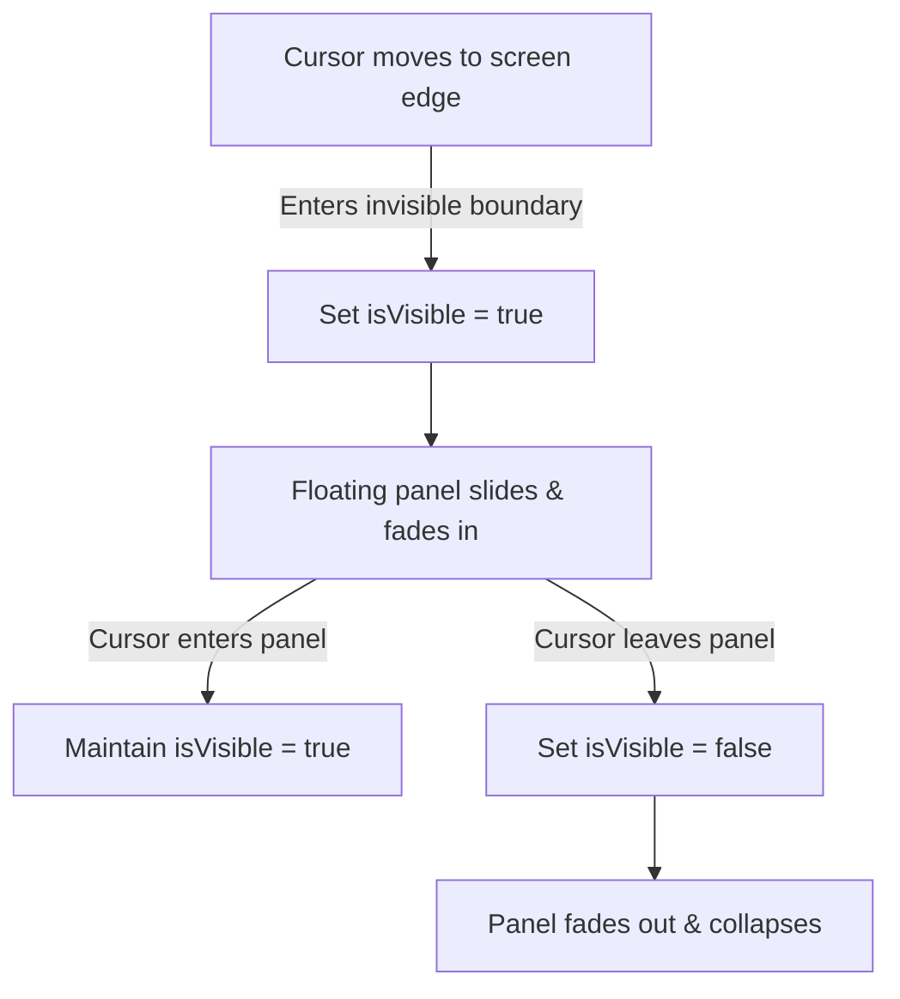

# Designing & Implementing Hover-Triggered Floating Navigation Docks

This skill outlines the design philosophy, UX guidelines, and implementation steps for hover-triggered floating navigation docks that replace persistent full-height sidebars in focused workspace interfaces.

## 1. Core Architecture

Hover-triggered floating navigation relies on three core components:
1. **Collapsed Mode Control**: Ensuring the default full-width sidebar collapses (e.g. `width: 0px` with `transition-property: width`) when the focused workspace is active.
2. **Invisible Hover Trigger Boundary**: A thin, absolute-positioned invisible zone on the screen edge (e.g., `position: absolute; left: 0; width: 12px; top: 0; bottom: 0;`) that detects hover intent (`onMouseEnter`) to set the menu visibility to `true`.
3. **Translucent Floating Panel**: The actual menu panel positioned next to the boundary. It handles `onMouseEnter` to keep itself open, and `onMouseLeave` to close itself.



---

## 2. Best Practices for Aesthetic & UI Design

To achieve premium, executive-tier visual aesthetics matching Arc, Figma, or Apple HIG:
- **Translucency & Blurring**: Use glassmorphism styling (`bg-white/95 backdrop-blur-md border border-gray-200 shadow-[0_8px_32px_rgba(0,0,0,0.06)]`).
- **No Monolithic Headers**: Remove branding logos (e.g. "Orb") inside transient hover panels to minimize vertical space and avoid unnecessary clutter.
- **Breathing Space**: Use generous padding (e.g., `p-4`) and gap spacing (e.g., `gap-4`) with clean `rounded-2xl` shapes to make the panel feel modern.
- **Micro-Animations**: Animate panels using high-performance CSS transforms (`translateY(-50%) translateX(...)` with `cubic-bezier(0.16, 1, 0.3, 1)` easing) to ensure smooth rendering on high-refresh-rate displays.

---

## 3. Reference Implementation

Below is a typical React JSX & CSS structure to implement hover navigation:

### React State & Event Boundaries
```jsx
const [isHoverNavVisible, setIsHoverNavVisible] = useState(false);

// 1. Invisible Hover Boundary on screen edge
<div
  onMouseEnter={() => setIsHoverNavVisible(true)}
  className="absolute left-0 top-0 bottom-0 w-3 z-[345]"
/>

// 2. Floating Panel
{isHoverNavVisible && (
  <div
    onMouseEnter={() => setIsHoverNavVisible(true)}
    onMouseLeave={() => setIsHoverNavVisible(false)}
    className="absolute left-4 top-1/2 -translate-y-1/2 z-[350] rounded-2xl border border-gray-200 bg-white/95 backdrop-blur-md shadow-lg p-4 flex flex-col gap-4 w-[240px] animate-floating-nav"
  >
    {/* Navigation Items */}
  </div>
)}
```

### CSS Animation Code
```css
@keyframes floatingNavSlideRight {
  from {
    opacity: 0;
    transform: translateY(-50%) translateX(-15px);
  }
  to {
    opacity: 1;
    transform: translateY(-50%) translateX(0);
  }
}

.animate-floating-nav {
  animation: floatingNavSlideRight 0.25s cubic-bezier(0.16, 1, 0.3, 1) forwards;
}
```

---

## 4. Manual / Button Synchronization

Always synchronize the hover dock with manual toggles (e.g., Header chevron buttons). If the user explicitly clicks the sidebar toggle button, intercept that action to toggle the floating navigation state instead of opening the standard desktop sidebar.
