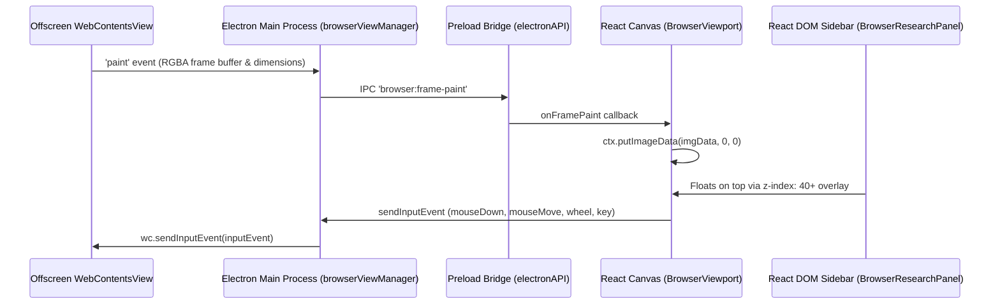

# Offscreen Rendering (OSR) & Canvas Painting Sidebar Architecture

## Overview

In traditional Electron browser applications, native web views (`BrowserView` or `WebContentsView`) sit in front of the parent window's React DOM layer. This native z-index barrier forces developers to choose between two sub-optimal approaches:
1. **Trimming/Shrinking Bounds:** Shrinking the native web view container width to make room for sidebars, altering the external web page layout.
2. **Native Popovers:** Spawning secondary OS popover windows that require complex cross-window state synchronization.

To solve this, Regaarder Browser implements **Electron Offscreen Rendering (OSR) & Canvas Painting**. Chromium renders external web pages directly into an in-memory frame buffer. The frame pixel buffer is streamed via IPC to the React renderer, which paints it onto an HTML `<canvas>` element.

As a result, standard React HTML elements (`<div style={{ zIndex: 999 }}>`, sidebars, popovers, slash menus) float **100% seamlessly directly on top of the live web page** without requiring any web page bounds shrinking or trimming.

---

## Architectural Workflow



---

## Key Components & Implementation Details

### 1. Electron Main Process (`browserViewManager.cjs` & `browserViewManager.js`)
- **Offscreen Web Preferences:** Web contents views are initialized with `webPreferences: { offscreen: true }`.
- **Target Frame Rate:** Configured with `wc.setFrameRate(60)` for smooth 60 FPS rendering.
- **Frame Paint Broadcast:** Listens to `wc.on('paint', (event, dirty, image) => { ... })`, extracts the RGBA bitmap buffer (`image.toBitmap()`), and broadcasts it to the renderer window via IPC:
  ```javascript
  wc.on('paint', (event, dirty, image) => {
    if (this.mainWindow && !this.mainWindow.isDestroyed()) {
      const size = image.getSize();
      const bitmap = image.toBitmap();
      this.mainWindow.webContents.send('browser:frame-paint', {
        tabId,
        width: size.width,
        height: size.height,
        buffer: bitmap,
        dirty
      });
    }
  });
  ```
- **Input Event Receiver:** Implements `sendInputEvent(tabId, inputEvent)` which forwards user interactions back to Chromium:
  ```javascript
  sendInputEvent(tabId, inputEvent) {
    const tabState = this.tabs.get(tabId || this.activeTabId);
    if (tabState?.view?.webContents && !tabState.view.webContents.isDestroyed()) {
      tabState.view.webContents.sendInputEvent(inputEvent);
    }
  }
  ```

### 2. Preload & Main Process IPC Handlers
- **`preload.cjs` & `preload.js`:** Exposes `window.electronAPI.sendInputEvent` and `window.electronAPI.onFramePaint`.
- **`main.cjs` & `main.js`:** Registers `ipcMain.handle('browser:send-input-event', ...)`.

### 3. React Canvas Viewport Engine (`BrowserViewport.jsx`)
- **Canvas Rendering:** Mounts an HTML `<canvas ref={canvasRef}>` element. Subscribes to `onFramePaint` and paints incoming RGBA byte arrays onto the 2D canvas context using `ImageData` and `ctx.putImageData(...)`.
- **User Input Listener & Coordinate Normalization:** Captures native canvas events (`onMouseDown`, `onMouseUp`, `onMouseMove`, `onWheel`, `onKeyDown`, `onKeyUp`), computes normalized coordinates relative to canvas bounding box, and forwards them to Electron via `sendInputEvent`.

### 4. Floating DOM Overlay Layout (`BrowserWorkspace.jsx`)
- **Untrimmed Web View Bounds:** Maintains `marginRight: 0px` for the `<canvas>` viewport in Electron mode, allowing the web page to occupy 100% of the workspace area.
- **Seamless Sidebar Overlay:** Renders `BrowserResearchPanel` as an absolute DOM element (`position: absolute; right: 0; top: 0; bottom: 0; z-index: 40;`) floating directly over the painted webpage canvas.

---

## Technical Trade-offs & Benefits

| Aspect | Native WebContentsView | Secondary Window Popover | OSR & Canvas Painting (Selected) |
| :--- | :--- | :--- | :--- |
| **DOM Overlay Flexibility** | ❌ Blocked by native view | ⚠️ Requires separate window | ✅ **Native React DOM (`z-index`)** |
| **Web View Bounds Trimming** | ⚠️ Webpage must shrink | ✅ Unshrunk | ✅ **100% Full Width (Unshrunk)** |
| **Window Motion Sync** | ✅ Native | ⚠️ Needs window move sync | ✅ **Perfect In-Window Lock** |
| **High FPS Video Overhead** | ✅ Direct GPU paint | ✅ Direct GPU paint | ⚠️ Frame copying CPU/GPU overhead |

---

## Verification & Build Status

- **Build Check:** Verified via `npm run build` with zero compilation errors.
- **Compatibility:** Fully backwards compatible with web fallback mode (iframes) and non-Electron browsers.
