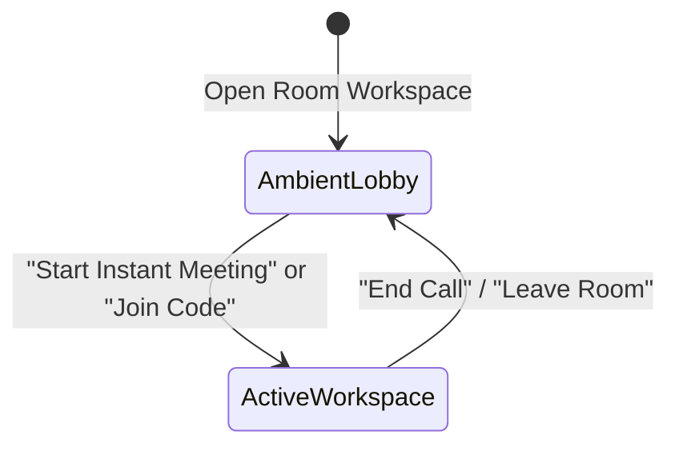

# Regaarder Room: Ambient Workspace Lobby Design System

## 1. Overview & Architectural Philosophy

The **Ambient Workspace Lobby** pattern represents a paradigm shift away from traditional, disconnected SaaS homepages and dashboard cards. Instead of navigating users to a separate landing page with disparate sidebars, activity feeds, and upgrade banners, the application maintains **spatial and visual continuity**.

The lobby is treated as a **temporary ambient entry veil** rendered directly in-place over the active workspace interface.

```
┌─────────────────────────────────────────────────────────────┐
│ Header: [Room Icon] Room   [Product Sync ⌵]   [👥 1]        │
├───────────────┬─────────────────────────────┬───────────────┤
│               │   [ Ambient Blur & Stage ]  │               │
│  People Panel │                             │  Chat Panel   │
│  (1 online)   │   ┌─────────────────────┐   │  (Everyone /  │
│               │   │   Welcome to Room   │   │   Direct)     │
│   Search...   │   │  [+ Instant Meeting]│   │               │
│   You (Host)  │   │  [# Enter Code    ] │   │  No messages  │
│               │   └─────────────────────┘   │               │
│  [+ Invite]   │   [Call Controls] [Ask AI]  │  [Compose...] │
└───────────────┴─────────────────────────────┴───────────────┘
```

---

## 2. Core Visual Principles & Staging

### 2.1 In-Situ Ambient Background Staging
* **Active Environment Visibility:** The full meeting workspace (Header, People Sidebar, Video Canvas, Call Controls Pill Bar, Ask Room AI Bar, and Chat Sidebar) is completely rendered in the background.
* **Ambient Inactive State:** When `isLobby` is active, the workspace layer receives an optical backdrop filter:
  - `blur-[7px]` (Soft progressive blur)
  - `grayscale-[25%]` (Subtle desaturation to signify inactive state)
  - `opacity-75` (Gentle luminance reduction)
  - `scale-[0.995]` (Subtle spatial receding effect)
  - `pointer-events-none` (Protects background elements from accidental clicks)

### 2.2 Glassmorphic Entry Card Hierarchy
The centered card uses executive-tier Apple glassmorphism:
* **Geometry:** `max-w-[420px] w-full rounded-[32px] p-7`
* **Surface Materials:** `bg-white/95 dark:bg-zinc-900/95 backdrop-blur-2xl`
* **Border Definition:** `border border-white/80 dark:border-white/10`
* **Elevation & Shadow:** `shadow-[0_24px_70px_rgba(0,0,0,0.1)]`

---

## 3. Component Anatomy & Micro-Interactions

### 3.1 Floating Ambient Badge
* **Central Icon Badge:** `52px x 52px rounded-2xl bg-violet-50/90 dark:bg-violet-950/60 border border-violet-100/80 dark:border-violet-800/60`
* **Ambient Sparkle Constellation:** Delicate purple starlets (`✦`) positioned around the badge with subtle pulsing animation to convey intelligent readiness.

### 3.2 Primary Call to Action: Start Instant Meeting
* **Visual Theme:** Soft lavender background (`bg-violet-50/80 dark:bg-violet-950/40`) with crisp violet border (`border-violet-200/70`).
* **Leading Icon:** Vibrant purple rounded square (`bg-violet-600`) with high-contrast white `+` icon (`size={16}`).
* **Typography:** Bold title (*"Start an instant meeting"*) with supporting metadata subtitle (*"Create a room and invite others"*).
* **Trailing Indicator:** Violet `ChevronRight` with subtle hover slide (`group-hover:translate-x-0.5`).

### 3.3 Secondary Action: Enter Room Code
* **Visual Theme:** Neutral surface (`bg-slate-50/80 dark:bg-zinc-850/60`) with subtle border (`border-slate-200/80`).
* **Leading Icon:** Light violet/zinc rounded square with `#` (`Hash`) glyph.
* **Interactive Code Affordance:** Expanding inline code input with automatic focus, uppercase normalization, and instant **Join** action.

---

## 4. Subsystem Preservations

The underlying Room workspace preserves all native subsystems:

| Subsystem | Components & Responsibilities |
| :--- | :--- |
| **Top Header** | Brand logo (`RoomIcon`), room name dropdown (`Product Sync ⌵`), live participant counter pill, encryption shield, recording pill, expand button, and contextual more options. |
| **People Panel** | Participant counter, instant search filter, self avatar preview with mute/camera indicators, empty state invite illustration, and dedicated invite actions. |
| **Video Stage & Call Controls** | High-fidelity canvas viewport with avatar fallback, microphone equalizer pulse, and floating call control pill bar (Mic, Camera, Screenshare, Layout, End Call). |
| **Ask Room AI Bar** | Integrated bottom prompt bar powered by signature [`RegaarderAiIcon`](file:///c:/Users/user/Downloads/Project%20MOAT/Regaarder%20Compose/src/components/RegaarderProductIcons.jsx#L328) with zero-latency meeting summary prompts. |
| **Chat Panel** | Segmented tabs for *Everyone* and *Direct Messages*, empty state messaging prompt, and clean composer bar. |

---

## 5. Smooth Transition Lifecycle



1. **Entry:** Workspace mounts with `isLobby: true`. The ambient blur and desaturation are applied immediately.
2. **Execution:** On selecting *"Start an instant meeting"* or submitting a valid room code, `isLobby` is set to `false`.
3. **Transition:** CSS transitions (`duration-500`) smoothly clear the blur and restore full saturation and interactivity without layout jumping or full-page routing.
4. **Exit/Reset:** Clicking the End Call button seamlessly returns the user to the ambient lobby state.

---

## 6. Implementation Reference

- Primary Component: [`RoomLandingPage.jsx`](file:///c:/Users/user/Downloads/Project%20MOAT/Regaarder%20Compose/src/RoomLandingPage.jsx)
- Brand Icon Grammar: [`RegaarderProductIcons.jsx`](file:///c:/Users/user/Downloads/Project%20MOAT/Regaarder%20Compose/src/components/RegaarderProductIcons.jsx)
