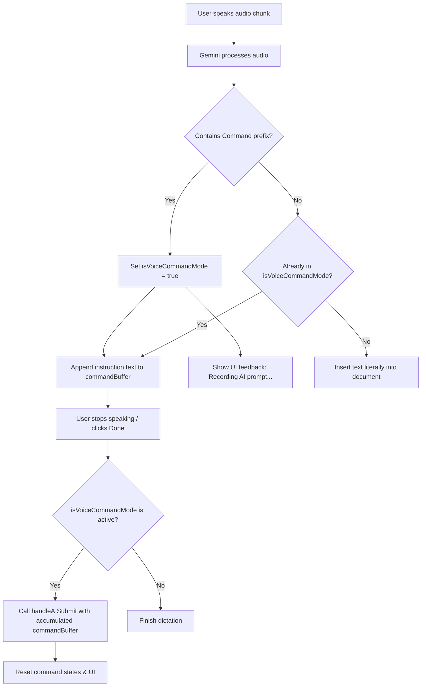

# Intelligent Voice Commands and Formatting via Dictation

This plan outlines how to make the voice dictation tool more intelligent by allowing users to speak commands (e.g., `"AI Prompt: add a table"`, `"AI Command: make the last line a title"`) to execute editing actions on the document, rather than just transcribing literal text.

---

## Proposed Concepts & Architectures

We propose a **Hybrid Semantic Command Router** that combines client-side prefix matching with semantic processing from the Gemini audio-reasoning model.

### 1. Spoken Command Triggers (Keywords)
To trigger a command, the user begins their speech with any of the following prefix keywords:
- **Command mode prefixes**: `"AI prompt"`, `"AI command"`, `"Hey AI"`, `"Hey Gemini"`, `"Format"`, `"Insert"`, or `"Execute"`.
- **Fuzzy matching (homophones)**: The client and API will account for mispronunciations/homophones like `"eye prompt"`, `"aye command"`, `"hey I"`, or `"hay AI"`.
- **Escape / Normal dictation prefixes**: If a user wants to write the literal words of a prefix, they can prefix it with `"Write"` or `"Dictate"` (e.g., `"Write: AI prompt is the future"` will output literal text).

### 2. The Command Execution Pipeline

We can implement this using a **Stateful Command Buffer**:

---

## Edge Cases and Failure Points

### 1. Chunk Boundary Segmentation
- **Problem**: Dictation is processed in 4-second audio chunks. If a user says `"AI Prompt... [pause] ...add a table"`, the trigger `"AI Prompt"` is in Chunk 1, but `"add a table"` is in Chunk 2.
- **Solution**: Once a command prefix is detected in *any* chunk, the application shifts into a persistent state `isVoiceCommandRef.current = true`. All subsequent chunks are treated as command instructions and appended to a `voiceCommandBufferRef` until the user finishes the recording session.

### 2. Homophones & Accidental Triggers (False Positives)
- **Problem**: The user says something like `"I prompt my students every day"`, and the AI incorrectly triggers a command.
- **Solution**: 
  - Strict prefix rule: The trigger keyword must appear at the *very beginning* of the dictation session (or immediately after a period/new sentence).
  - Explicit Normal Mode prefix: Users can prefix text with `"Write"` or `"Dictate"` to bypass commands.
  - Client-side fuzzy matching: Include a fallback regex to catch common homophones: `/\b(ai|i|eye|aye|hey|hay)\s*(prompt|command|gemini|helper)\b/i`.

### 3. Latency & User Interface Feedback
- **Problem**: When executing a command, there is a delay while Gemini generates the changes (e.g., creating a table). If the UI doesn't provide feedback, the user might think the app is frozen.
- **Solution**:
  - Show a clear status in the dictation overlay (e.g., `"AI is generating your table..."` with a spinner).
  - Highlight the text or play a typing animation in the editor while the AI is modifying the document.

### 4. Canceling a Command Mid-Speech
- **Problem**: The user starts a command but changes their mind or misspoke.
- **Solution**:
  - Spoken cancel command: Saying `"cancel"` or `"cancel prompt"` will immediately abort the command mode and clear the buffer.
  - UI Button: Add a "Cancel" button on the voice dictation card during command mode to clear the buffer.

---

## Proposed Changes

### [Component Name]
We will implement these changes within the existing backend API and the frontend application `src/App.jsx`.

#### [MODIFY] [gemini.js](file:///c:/Users/user/Downloads/Project%20MOAT/Regaarder%20Compose/api/gemini.js) (Optional)
- We will update the system prompt for transcription to recognize command prefixes and format them using a standardized tag `[COMMAND] <instruction>`, making it simple for the frontend to classify the intent.

#### [MODIFY] [App.jsx](file:///c:/Users/user/Downloads/Project%20MOAT/Regaarder%20Compose/src/App.jsx)
- **State Additions**:
  - `isVoiceCommandMode`: Tracks if the active dictation is a command.
  - `voiceCommandBuffer`: Accumulates the spoken command instructions.
- **Logic Updates in `processAudioWithGemini`**:
  - Check if the incoming transcript starts with a command prefix or `[COMMAND]`.
  - If yes, set `isVoiceCommandMode = true` and append the instructions to the command buffer.
  - Update the dictation overlay UI to display the pending command text.
  - On stop/done, if `isVoiceCommandMode` is active, call `handleAISubmit(voiceCommandBuffer, { source: 'compose' })`.

---

## Verification Plan

### Automated Tests
- Run `npm run build` to verify compiling succeeds.

### Manual Verification
1. **Start Dictation**: Click the microphone icon.
2. **Literal Text Test**: Dictate `"Hello world, this is a test document."` -> Verify text is inserted literally chunk-by-chunk.
3. **Voice Command Test**: Dictate `"AI Prompt: add a table of marketing metrics with 3 columns."` -> Verify the UI displays `"Recording AI Prompt..."`, does *not* write text to the document immediately, and upon stopping, triggers the table creation.
4. **Fuzzy Matching Test**: Dictate `"eye prompt: make the last line a heading 1"` -> Verify it enters command mode correctly.
5. **Cancel Command Test**: Dictate `"AI Prompt: make this bold... cancel prompt"` -> Verify command mode resets without applying changes.
